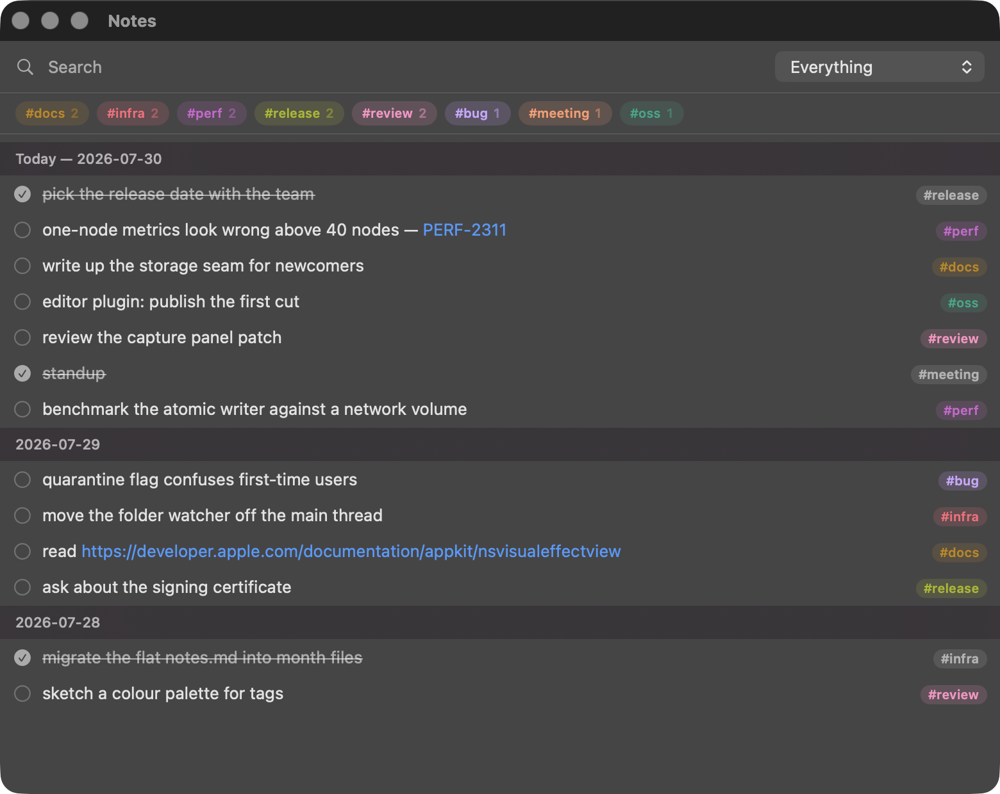
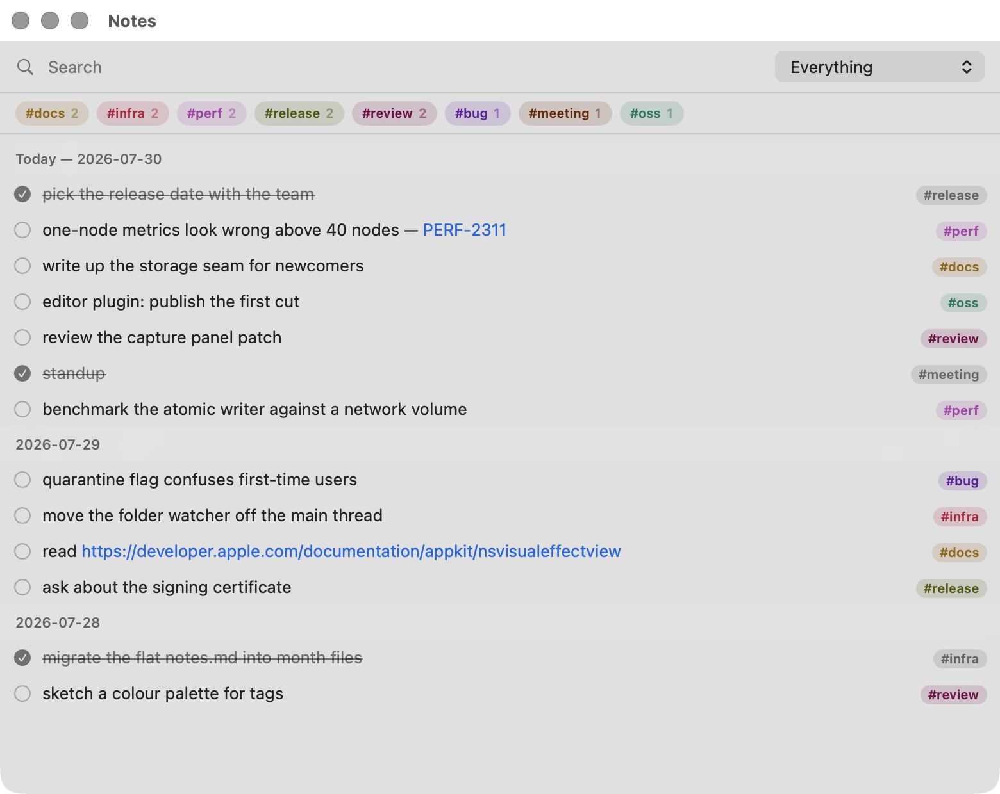

# dnotes

A macOS app for writing a thought down in under two seconds, into plain markdown files
you own.

Press `⌥Space` anywhere, type one line, press `⏎`. Focus returns to whatever you were
doing and the line is appended to today's heading in `YYYY-MM.md`. Delete the app and
the notes are still there, readable in any editor and diffable in git.

The hotkey is the way in, from any app including fullscreen ones. There is a menu bar
item too, and a Dock icon if you want one — Settings → Appearance — but neither is where
the app is meant to be used from.

```markdown
## 2026-07-29

- open source editor plugin #oss
- [x] run their artifact analysis tool
- single node metrics — ABC-1234 #infra
```



<details>
<summary>The same list in light mode</summary>

Tag colours are picked per theme rather than dimmed: a tag is text, so each colour has to
stay readable against the surface it sits on. That is why the light steps are deep instead
of bright.



</details>

## What it is, and is not

One entity: the line. A note becomes a task because it can be closed — there are no
types, no due dates, no priorities, no projects, no nesting. Tags are `#word` inside the
text, not a separate field. There is no sync protocol: put the folder in iCloud Drive,
Dropbox or git and that is the sync.

The design document, [2026-07-29-dnotes-design.md](2026-07-29-dnotes-design.md), is the
reference for all of this; the `§` numbers throughout the code point into it. The
implementation plan that produced the code is in [plan/](plan/).

## Using it

| | |
| --- | --- |
| `⌥Space` | capture panel; `⏎` saves, `⇧⏎` saves and stays open, `esc` keeps a draft |
| `#` | tag completion; `⌘1`–`⌘3` append a frequent tag |
| `⌥⇧Space` | the notes list |
| `↑` `↓` | move between entries |
| `␣` | complete or reopen |
| `e` or `⏎` | edit in place |
| `⌫` | delete |
| `⌘Z` | undo the last change, fifty steps deep |
| `⌘F` | search; `esc` clears search and filter |
| `⌘,` `⌘L` | settings and the list, from the capture panel |

Hold `⌘` to make a URL or an issue key in a line live, then click it. Issue keys need a
URL template in Settings — only you know which tracker `ABC-1234` belongs to.

Tags are coloured, and each one keeps its colour. By default they are lifted out of the
text into chips at the end of the row, so a note reads without them; Settings switches
them back into the text. Right-click a chip above the list to pick a tag's colour by hand.
Either way the file is unchanged — a tag is plain text in the line, so editing a row shows
it exactly as stored.

## Building

Needs macOS 14 or newer and a Swift 6.2 toolchain. No dependencies.

```sh
./scripts/test.sh     # 216 tests
./scripts/bundle.sh   # produces dnotes.app
open dnotes.app
```

`scripts/dmg.sh` packages the bundle into a disk image for a release.

`scripts/test.sh` rather than `swift test` because the suite adapts to whichever
toolchain is installed: with only Command Line Tools, swift-testing needs a framework
search path that SwiftPM does not add, and the Testing+Foundation cross-import overlay
ships without its `.swiftmodule`. The script handles both and gets out of the way when
full Xcode is present.

The bundle is ad-hoc signed, which is enough to run it locally. Distribution signing
needs a Developer ID certificate, so the disk image on the releases page is quarantined
by macOS like any unsigned download — opening it the first time takes one extra step,
described in the release notes. Building from source avoids that entirely.

## How it is built

Logic lives in `DnotesCore`, which imports no AppKit and no SwiftUI, and is where the
tests are. `Dnotes` is the shell: status item, a non-activating `NSPanel` for capture, an
`NSWindow` for the list, a main menu. AppKit owns that shell deliberately: keyboard and
pointer behaviour this central should not depend on which view happens to hold focus, and
the shell was first written for a menu-bar-only app, which has no menu bar for SwiftUI to
hang shortcuts on. Whether the app is menu-bar-only is a setting now, so the shell has to
work both ways — and it was already in the right place for that.

**Storage is behind a protocol.** `NotesRepository` is the seam;
`MarkdownNotesRepository` is the file-backed implementation and `InMemoryNotesRepository`
is the second conformer the model's tests run against. Both pass the same conformance
checks. Nothing above the seam knows what a file is — an entry is a `NoteEntry` carrying
an opaque `EntryID`, while month files, line indexes and duplicate ordinals stay inside
the implementation. `Composition.swift` is the only file that names a concrete backend.

**Nothing you did not write gets rewritten.** `Line.raw` holds a line's original bytes
and serialization concatenates `raw + ending`, so `parse → serialize` is byte-exact for
anything the parser did not understand: unparsed lines, blank lines, CRLF, a missing
trailing newline. Writes are atomic, and when a file changed underneath us the target
line is found by its text within its own day and by its duplicate ordinal — cancelling
rather than guessing when that cannot resolve it.

**Text is never silently lost.** A confirmed capture that cannot be written waits in a
queue that survives a restart and drains to its own day, not to today. Every way of
closing the capture panel keeps what was typed. Leaving a row mid-edit commits it. `⌘Z`
is what makes plain `⌫` an acceptable delete.

## Licence

MIT. See [LICENSE](LICENSE).
